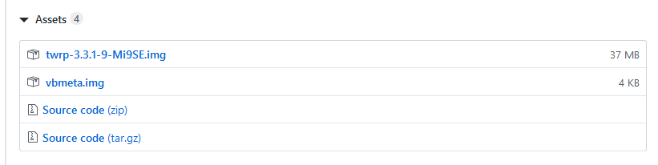
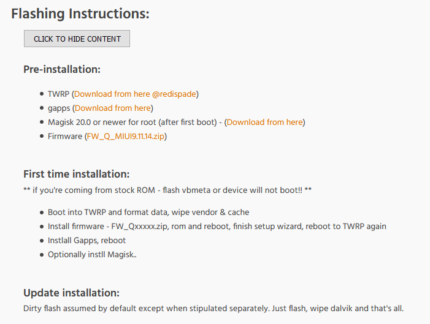

# 小米9se （grus）刷机教程

> 2020.1.11 更新。选择的rom为CRDroid android 10

步骤目录：

1. 解锁BootLoader
2. 刷twrp
3. 刷底包，刷rom，刷vbmeta.img
4. 救砖
5. 体验分享


### 1.解锁BootLoader

登陆网站（http://www.miui.com/unlock/index.html）申请解锁小米手机。

它这个是有一些要求，要求手机绑定小米账号至少15天（貌似），才可以解锁手机。

- 手机绑定小米账号
- 下载小米解锁工具
- 手机连接电脑后按提示操作

这里就不做详细解释了，这一步很简单，按照步骤来基本上不会出现什么问题。


### 2.刷twrp

参考帖子：https://forum.xda-developers.com/mi-9-se/development/twrp-3-3-1-3-mi9se-t3949328

在选择twrp的时候，尽量选择最新的版本，新版本提供了一些新的特性，以及对最新android版本rom的支持。这里我选择的是twrp-3.3.1-11.Mi9SE，这个版本支持android Q，也就是android 10

这里还要提一下`vbmeta.img`，貌似vbmeta.img 是与twrp相关联的。

我们去这个twrp的仓库看它的release(https://github.com/redispade/device_xiaomi_grus-twrp/releases)版本，在前面几个版本中，发布了twrp的同时也发不了vbmeta.img，所以猜测这里二者是有某种关联的。最新的twrp版本中没有vbmeta.img，所以刷机的时候采用了最近发布的一次vbmeta.img。



另外，还需要刷vbmeta.img（有的rom需要刷这个），需要使用最新的fastboot工具，原始的下载链接找不到了，就直接把资源上传上来。在`assets/platform-tools_r29.0.5-windows.zip`

刷twrp步骤：

1. 下载解压最新fastboot工具

2. 将上面下载的vbmeta.img 拷贝到与fastboot.exe相同的目录中
3. 按住Shift，鼠标右键，选择在此处打开命令行窗口
4. 手机关机状态下，按住电源+音量下。启动到fastboot模式
5. 手机连接到电脑，在命令行输入`fastboot.exe devices`查看当前连接的设备，此时会有一行输出
6. `fastboot flash recovery twrp-3.3.1-10-Mi9SE.img`命令刷写twrp
7. 刷写完成后，按住电源+音量上，直到震动，此时会进入twrp
8. 下面开始刷rom


### 3.刷底包，刷rom，刷vbmeta.img

这里我选择的rom为CrDroid android 10的包（https://forum.xda-developers.com/mi-9-se/development/rom-crdroid-6-0-t4021505）

仔细阅读刷机教程：



1. 下载好底包和rom，下载gapps（我选择的是open_gapps-arm64-10.0-nano-20191209-BETA）

2. 进入twrp，然后4清，data/ vendor cache 还有一个是dvlink什么虚拟机

3. 刷入底包

4. 刷入rom，注意此时不要重启，刷完rom之后按住电源+音量下，再次进入fastboot模式

5. 刷vbmeta.img，这里的vbmeta为上一步下载twrp的时候下载的。执行命令刷入vbmeta.img

   > fastboot --disable-verity --disable-verification flash vbmeta vbmeta.img
   >
   > 如果这个命令报错--disable-verity 没找到这个参数，那么说明需要最细的fastboot

6. 刷完了vbmeta.img 就可以重启进入到系统了

7. 【可选】刷gapps，重新进入twrp，然后flash一下下载的gapps的zip包就可以了


### 4.救砖

之前由于没有仔细阅读刷机教程，刷了一次，然后就无限循环重启fastboot，也就是

```
** if you're coming from stock ROM - flash vbmeta or device will not boot!! **
```

其实就是没有正确是刷入vbmeta.img

后来的解决方法就是去了一趟售后，等了半个小时后，给我刷回来了。实际上就是线刷。

当天下午我就去官网找到了线刷包，所以在此遇到这种情况的时候，就可以自己通过救砖救回来了。


### CrDroid 体验

纯原生的Android 系统，刚刚进入界面的时候还是非常惊艳的，没有那么多臃肿的功能，这才是我想要的android系统。不过还是有一些个小问题

1. 相机拍照太垃圾了。找了谷歌相机，但是9se的android 10 相机好像没有几个能用的。
2. NPC不能用，也就是不能用手机刷公交卡，另外NPC也不能读取实体公交卡，无法充钱
3. 解锁屏幕，屏幕会突然亮一下，就是亮度特别亮的闪一下
4. 声音问题，日常听歌没毛病，但是在使用微博国际版的时候，刷到了视频点开，会出现一次爆音
5. 闪退。桌面遇到过一次闪退，不过立刻恢复了，还有就是相机闪退过一次。这些影响到还好可以忍受
6. 通话，不知道为啥我今天接了一个电话没有声音，不知道是不是rom的问题
7. 垃圾短信，由于之前习惯了miui中短信的拦截，所以现在会收到很多淘宝等的短信通知
8. 其它


总之最无法接受的是相机，没有谷歌相机真的不能用。

NPC现在也有点离不开了，还有就是微博的爆音问题。

这些痛点实际上有点难以接受。其它问题到还好。