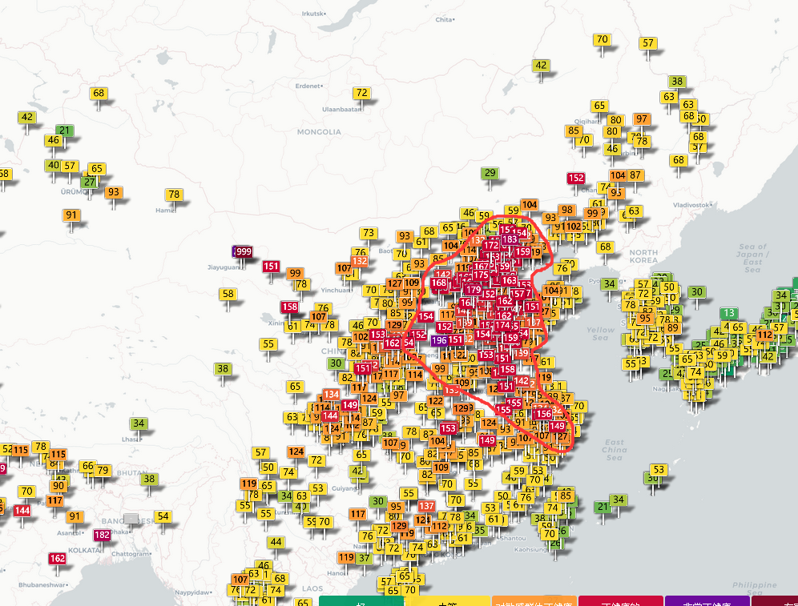
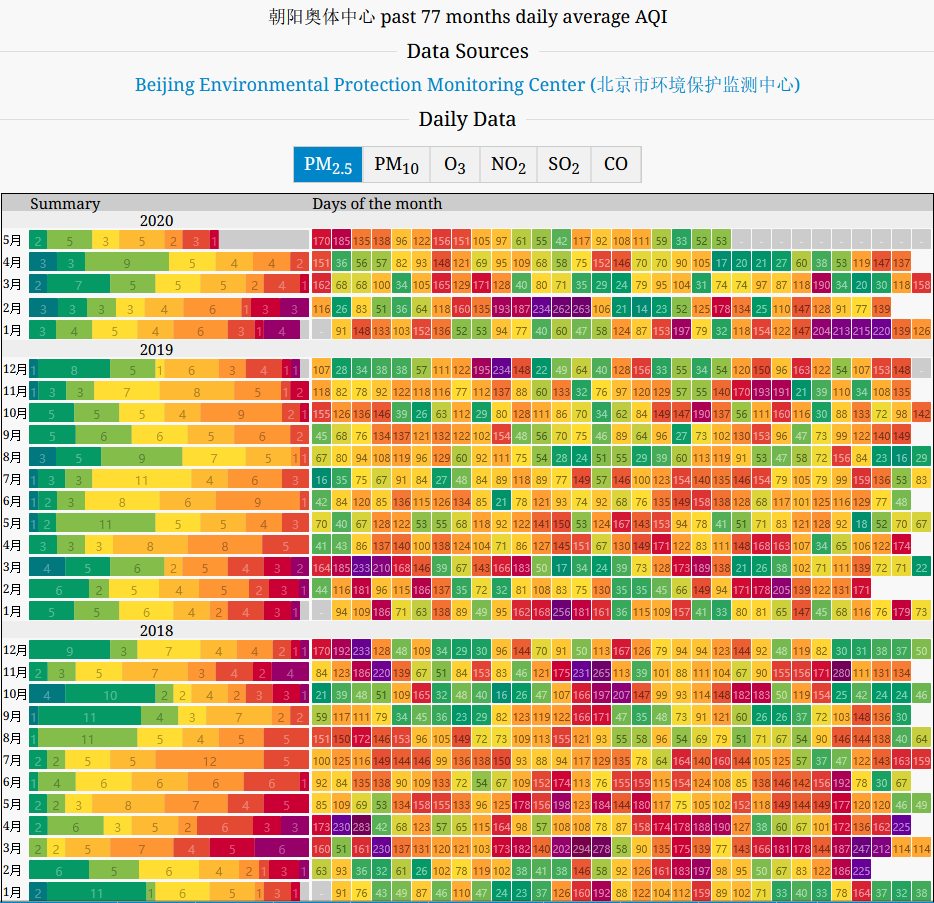
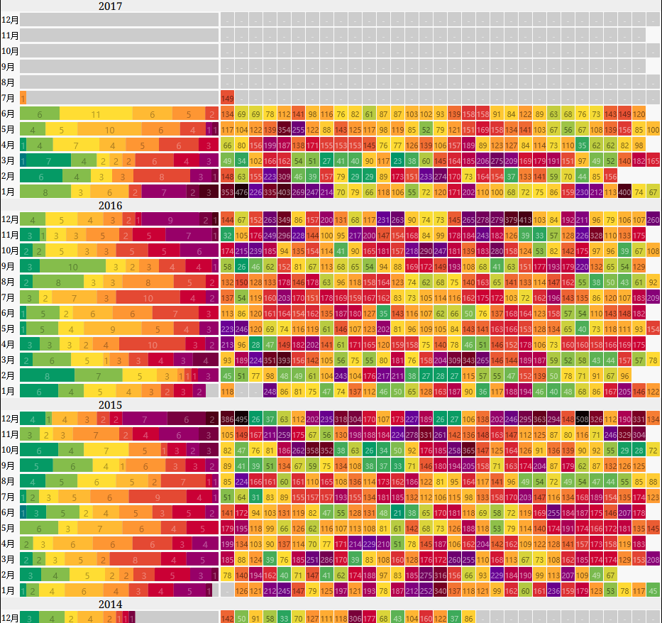
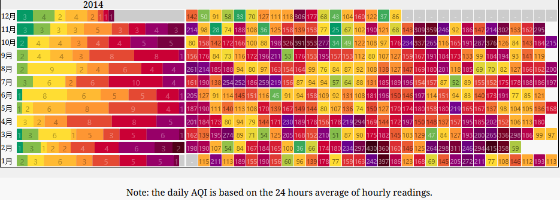
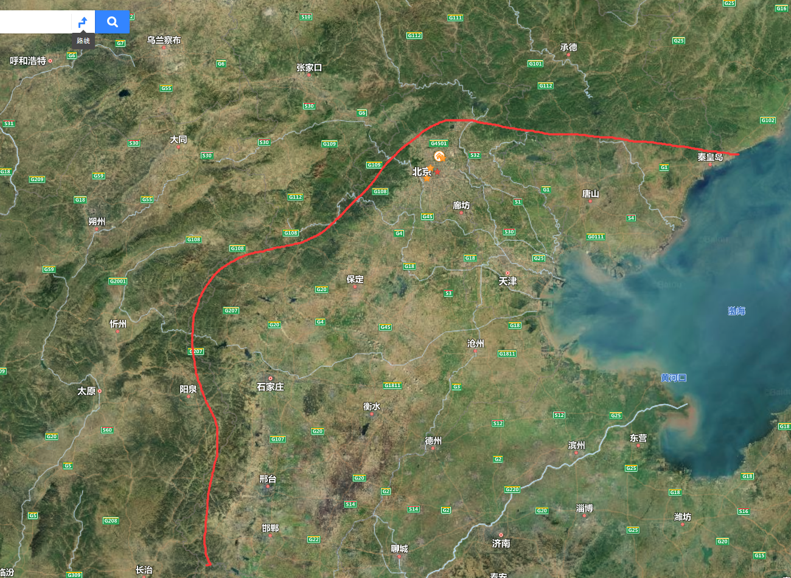
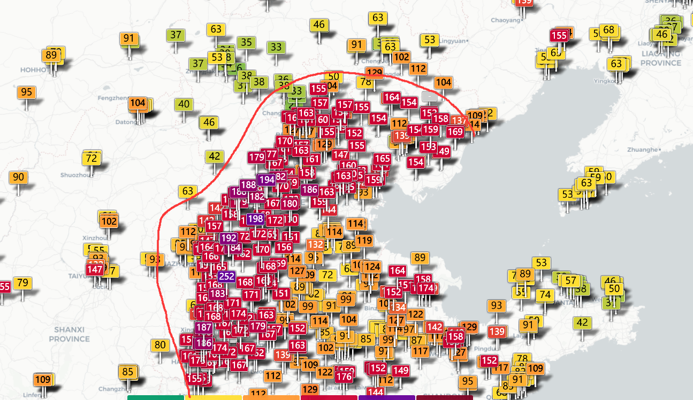
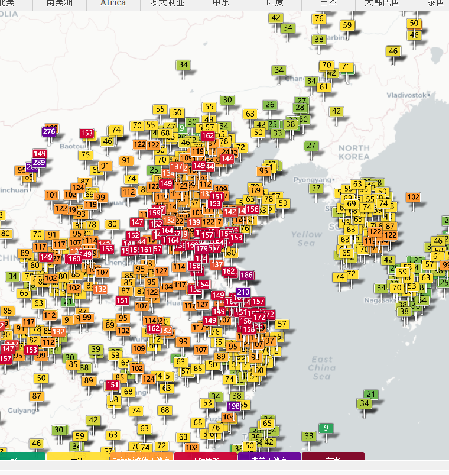
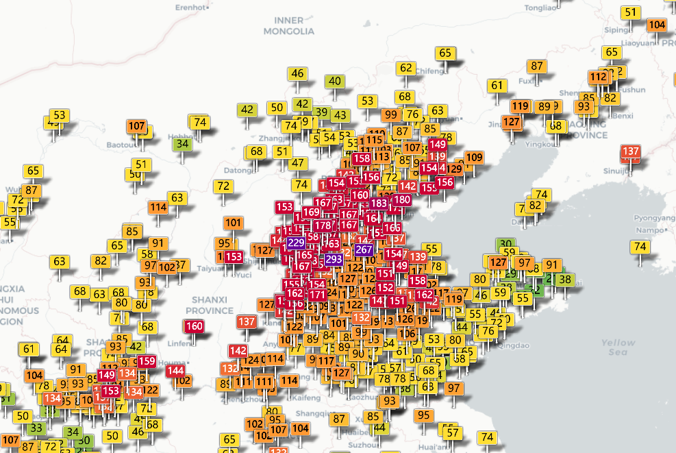

[toc]

### 北京地区空气问题总述

由于过敏性鼻炎的问题，现在越发的重视空气质量的问题。

上图为2020.5.21日，实时空气质量指数地图。其中红色圈出来的区域，为我最近经常看到的为红色的区域。

主要的空气污染物为pm2.5，当然夏天从外地回到帝都，刚下高铁会闻到一种恶臭，这种味道是臭氧污染，帝都的O3污染也比较严重。

红色区域北到河北承德，秦皇岛，向南依次有北京（挑大城市说），廊坊，天津，石家庄，西部到太原，临汾。

邢台，山东济南，枣庄，郑州洛阳，南 到合肥，杭州等地，沿海的烟台威海青岛还不错。另外大连开发区也还可以。

污染物比较集中的地区有很明显的特点，就是炼钢炼油企业特别多。典型地区为河北和天津。

帝都本身污染还好，虽然车比较多，但这不是造成污染的主要原因。昨天上午空气还算好，但是到了下午晚上，由于一直刮北风，帝都的污染指数一直在增加，到晚上凌晨左右达到污染最重。

另外帝都的空气质量也受南风的影响，春秋季节比较明显，是从北部吹来的沙尘等。主要污染物为pm10。

下图为离我最近的奥森监测点，最近77个月的空气质量统计图。

从上述统计的图表来看，14/15年最为严重，到2020年逐渐转好一些。

能看出来，帝都的空气质量从14年到现在，是一个逐渐变好的过程，然而这个好的程度依旧没有达到我期望的值，一周内必定有几天因为空气质量问题而流鼻涕，流眼泪。这已经成为我逃离帝都的一个最重要的理由--不适合居住。

----------------------------

### 那些城市还算可以？

首先值得考虑的城市是东北的一些城市，在我看来东北的城市虽然在冬季会因为供暖，造成一些污染，但是由于没有这些重工业生成厂，故总体的空气质量还算靠谱。

#### 1. 大连

看开发区最近5年的空气质量，绿的还是很多，算是比较好的了，而且经济发展在东北来讲也算是可以的了

#### 2. 沈阳

沈阳毕竟是省会城市，城市够大，有一定的工业基础，经济发展稍逊色于大连，搞软件开发应该没有在大连好做。收入是个问题，但是沈阳的房子应该还算便宜。

------------------------------------

### 地形对于雾霾扩散的影响简要分析

2020.5.22 日空气质量图

可以简单的看出来，地形确实对雾霾有一定的界限划分，山脉等等，会对气流等有一定的影响，但是不是绝对的。

主要是天津河北等地产生的pm无法有效的扩散出去，导致一直积累。

---------------------
2020 06 01

从下图中可以得到的信息：
有几块是污染中心：天津、洛阳郑州开封菏泽枣庄临沂这一条、盐城泰州苏州这一块，成都为中心的一块，西安这一块也是150附近。

-----------------------
2020 06 04

昨天空气重度污染，主要是因为浮尘。pm10为主要污染物

今天帝都空气优，然而中间这一块还是红的。东北的城市都在100以内，没有超过100的

重庆，成都，西安，有中度污染，跟城市有关

-----------------------

2020 06 10
先分享一个海外学者研究的结论。介绍了与华北平原雾霾产生的原因也有关系。

[研究称华北平原将因极端高温天气而无法居住，是否危言耸听？](https://www.toutiao.com/i6812956710680920580/?tt_from=mobile_qq&utm_campaign=client_share&timestamp=1591581446&app=news_article&utm_source=mobile_qq&utm_medium=toutiao_android&use_new_style=0&req_id=2020060809572601001404703303DF10C9&group_id=6812956710680920580)

气温：
最近几天帝都的最高气温一直在30度以上，而且这几天的首要污染物为臭氧O3，结合上面的文章来看，一个是城市效应，一个是人类活动，工厂等排放污染物，导致一个恶性循环。气温上升。

污染同样是集中在这个区域内。

帝都以`朝阳奥体中心`为例，AQI

| 类型 | 值范围 |
-------|---------
pm2.5 | 57~176
pm10  | 19~87
O3    | 11~91

下午外面特别晒，中午睡觉的时候感觉鼻子有点难受，带着肺部也不是很舒服。戴上防雾霾口罩，感觉稍好些。但是夏天太热了，戴不住